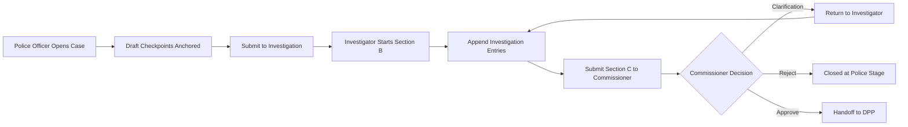
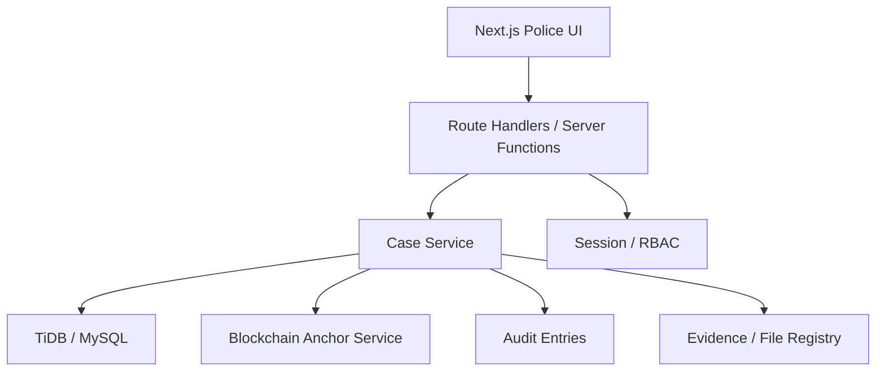

# Police Department System Design

## 1. Scope

This design covers the police department slice of the justice platform only. It includes:

- Police officer case opening and amendment
- Investigation intake and append-only investigation work
- Police commissioner review and command decisions
- Police administration, staff management, and audit visibility
- Police-owned evidence, statements, exhibits, and chain-of-custody records

It stops at the handoff to the DPP office. Court, correctional services, and appeal stages are out of scope except where they affect police handoff requirements.

## 2. Current System Context

The existing implementation already provides a strong baseline:

- Frontend: Next.js app router with role-based pages under `app/police`, `app/investigation`, `app/commissioner`, and `app/police-admin`
- State model: shared `CaseData` object with police-specific nested sections
- Server layer: case lifecycle operations in `lib/server/cases.ts`
- Database: TiDB/MySQL for off-chain operational data and audit rows
- Blockchain: case checkpoint and finalization anchors for tamper-evident history

## 3. Police Roles

### 3.1 Police Officer

- Opens a new case
- Saves draft checkpoints
- Finalizes and submits case to investigation
- Views only own cases unless granted wider access

### 3.2 Police Investigator

- Receives cases in `pending_investigation`
- Creates and locks the initial investigation capture
- Appends investigation actions and documentation
- Submits completed docket to commissioner
- Responds to clarification requests

### 3.3 Police Commissioner

- Reviews submitted investigation packets
- Approves to DPP, rejects, or requests clarification
- Uses commissioner forms for command review artifacts
- Monitors queue health and police audit trail

### 3.4 Police Admin

- Registers and manages police users
- Reviews staff activity and operational dashboards
- Oversees department-level configuration and compliance

## 4. Core Domain Model

### 4.1 Aggregate: Case

The police department revolves around a single case aggregate with these main areas:

- Core metadata: `caseId`, `caseNumber`, `charge`, `district`, `status`, timestamps
- Ownership: `policeOfficerId`, `policeOfficerName`
- Police sections:
  - `sectionA`: police opening form
  - `sectionB`: investigation record
  - `sectionC`: commissioner submission package and clarification thread
- Decision records:
  - `commissionerDecision`
- Integrity records:
  - `chainAnchor`
  - audit entries

### 4.2 Supporting Entities

- `case_parties`: complainants, suspects, witnesses, victims
- `statements`: recorded statements with content hashes
- `evidence_items`: digital evidence metadata and storage references
- `exhibits`: physical evidence with custody status
- `chain_transfers`: chain-of-custody handoffs
- `case_assignments`: investigator assignment history
- `case_events`: normalized milestone log
- `audit_entries`: immutable operational trail

## 5. Police Workflow

### 5.1 Statuses In Scope

- `draft_police`
- `pending_investigation`
- `in_investigation`
- `pending_commissioner`
- `commissioner_clarification`
- `rejected`
- `submitted_to_dpp`

### 5.2 Target Flow

### 5.3 Workflow Rules

- Police form checkpoints are forward-locked once anchored.
- Investigation initial capture becomes read-only after save; later updates are append-only.
- Commissioner clarification must preserve both the original request and the investigator response.
- Approval to DPP must include a complete audit trail and latest chain anchor.

## 6. Functional Modules

### 6.1 Case Opening Module

Purpose:
Capture the official police complaint and offence details using the staged Section A form.

Inputs:

- reporting method
- complainant and aggrieved person data
- alleged offence and occurrence details
- property, injury, weapons, suspect, and witness details

Outputs:

- draft case
- step checkpoints
- finalized police opening record

### 6.2 Investigation Module

Purpose:
Convert the police opening form into a structured investigation docket.

Capabilities:

- accept assigned or queued cases
- save initial investigation capture
- append evidence follow-up actions
- maintain documentation and budget notes
- generate recommendation for commissioner review

### 6.3 Commissioner Review Module

Purpose:
Provide command-level review of the police packet before prosecution handoff.

Capabilities:

- inbox of cases pending commissioner review
- packet review screen
- structured forms such as briefing, complaint review, and evidence retention
- approve, reject, or request clarification

### 6.4 Police Administration Module

Purpose:
Manage staff, access, and compliance oversight for the department.

Capabilities:

- register police staff
- view department dashboards
- monitor activity logs
- enforce department policy and RBAC

## 7. Architecture

### 7.1 Logical Architecture

### 7.2 Recommended Service Boundaries

For the police department, we should treat the backend as four bounded modules even if they remain in one codebase for now:

- `police-intake-service`
  - Section A drafts, checkpoints, final submission
- `investigation-service`
  - assignments, Section B, Section C, clarification responses
- `command-review-service`
  - commissioner inbox, decisioning, command forms
- `police-admin-service`
  - staff directory, permissions, department dashboards

This keeps ownership clean without forcing early microservices.

## 8. Data Design

### 8.1 Case Storage Pattern

Current storage mixes:

- relational columns for fast filtering
- JSON payload for flexible case sections
- blockchain anchor fields for integrity proof

That pattern is good for the police module because the forms are large and evolve often.

### 8.2 Recommended Relational Indexes

- `cases(status, updatedAt)`
- `cases(createdById, status)`
- `cases(district, status)`
- `case_assignments(assignedToUserId, createdAt)`
- `audit_entries(caseId, timestamp)`
- `evidence_items(caseId, createdAt)`
- `chain_transfers(exhibitId, transferAt)`

### 8.3 Recommended JSON Partitioning

Keep these in payload JSON:

- long-form Section A/B/C form content
- commissioner notes and clarification thread
- generated summaries and presentation data

Promote these to top-level columns when they become heavily queried:

- assigned investigator
- station
- severity
- crime type
- commissioner decision

## 9. Security and Access Control

### 9.1 RBAC

Each police route and action should be enforced by both UI role guards and server-side authorization.

Minimum permissions:

- `police.case.create`
- `police.case.checkpoint`
- `police.case.submit_to_investigation`
- `police.investigation.start`
- `police.investigation.append`
- `police.investigation.submit_to_commissioner`
- `police.command.review`
- `police.command.approve`
- `police.command.reject`
- `police.command.request_clarification`
- `police.admin.manage_staff`
- `police.audit.view`

### 9.2 Data Visibility

- Police officers: own cases only
- Investigators: assigned cases or queue-approved cases
- Commissioner: all police review packets
- Police admin: staff and operational views, not unrestricted case editing by default

### 9.3 Integrity Controls

- every checkpoint and milestone writes an audit row
- blockchain anchor stores content hash for tamper evidence
- append-only rules apply to investigation history and clarification history

## 10. Non-Functional Requirements

- Availability: police intake must remain usable during high-volume reporting periods
- Auditability: every status change must be attributable to a user, time, and action
- Traceability: each major police milestone should have a DB record and blockchain anchor
- Performance: dashboard and queue pages should load from indexed summary fields, not full payload scans
- Recoverability: draft checkpoints must survive browser refresh, server restart, and partial submission failure

## 11. API Design

### 11.1 Current Relevant APIs

- `POST /api/cases`
- `POST /api/cases/checkpoint`
- `POST /api/cases/finalize`
- `POST /api/cases/commissioner-clarification`
- `POST /api/cases/register-to-prosecutor`

### 11.2 Recommended Police API Surface

- `POST /api/police/cases/draft`
- `POST /api/police/cases/{id}/checkpoint`
- `POST /api/police/cases/{id}/submit`
- `POST /api/police/cases/{id}/assign-investigator`
- `POST /api/police/investigations/{id}/start`
- `POST /api/police/investigations/{id}/entries`
- `POST /api/police/investigations/{id}/submit-to-commissioner`
- `POST /api/police/commissioner/{id}/approve`
- `POST /api/police/commissioner/{id}/reject`
- `POST /api/police/commissioner/{id}/clarifications`

This is mainly a naming and ownership cleanup over the current mixed case lifecycle routes.

## 12. Blockchain Design

The blockchain should not store full police case data. It should store:

- record identifier
- action type
- content hash
- actor metadata reference
- timestamp or block height

Off-chain storage remains the source for operational reads. Blockchain acts as the tamper-evidence layer for:

- case creation
- police checkpoints
- investigation milestones
- commissioner decisions
- handoff to DPP

## 13. Observed Gaps in the Current Implementation

### 13.1 Role Naming Drift

Some screens and registration pages still mix old role names such as `police`, `investigation`, and `commissioner` with newer names like `police_officer`, `police_investigator`, and `police_commissioner`. The police design should standardize on one role vocabulary.

### 13.2 Case Payload Is Doing Too Much

The JSON payload is flexible, but too many operational filters still depend on payload fields. Police queue performance will degrade as case volume grows unless summary columns are promoted.

### 13.3 Assignment Model Is Underused

A dedicated `case_assignments` table exists, but the main police flow still stores assignment-related data inside payload sections. The system design should shift assignment history into the relational model.

### 13.4 Evidence Module Needs Stronger Integration

Evidence, exhibits, statements, and transfers exist at schema level, but the police UI flow is still centered on form payloads. The target design should make evidence handling a first-class police workflow, not a sidecar.

## 14. Recommended Next Build Steps

1. Standardize police roles and permissions across UI, API, and DB seed data.
2. Split police backend logic into intake, investigation, command review, and admin modules.
3. Move investigator assignment and commissioner decision summaries into indexed columns.
4. Wire evidence, statements, and exhibit custody into the investigation screens.
5. Add a police case timeline view backed by `audit_entries` plus blockchain anchors.
6. Add department-level SLAs for intake, investigation aging, and commissioner turnaround.

## 15. Proposed Success Metrics

- average time from case opening to investigation start
- average time from investigation submission to commissioner decision
- clarification rate per investigator or station
- rejection rate at commissioner stage
- number of anchored checkpoints per case
- evidence chain-of-custody completeness rate

## 16. Summary

The police department should be treated as a self-contained operational domain with four subdomains: intake, investigation, command review, and admin. The current codebase already contains most of the building blocks. The main design work now is to formalize boundaries, normalize role and status vocabulary, strengthen evidence and assignment modeling, and keep blockchain focused on integrity proofs rather than transactional reads.
